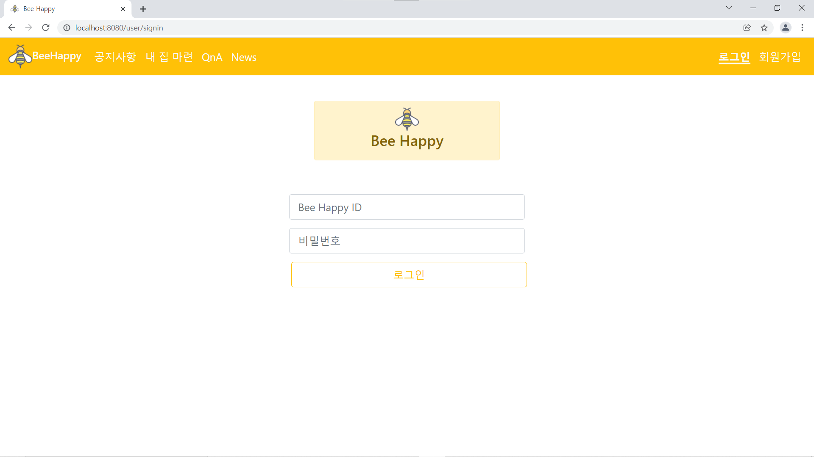
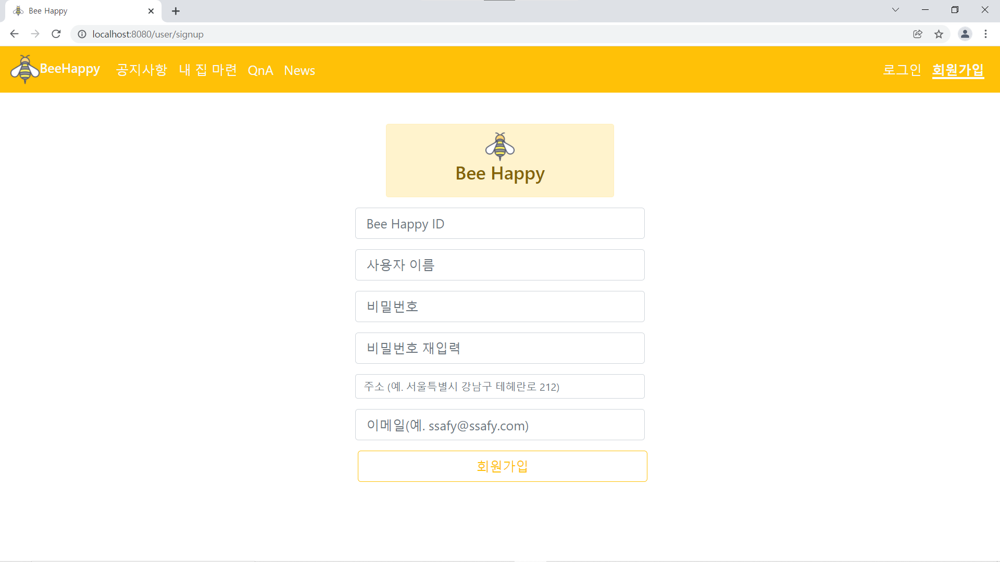
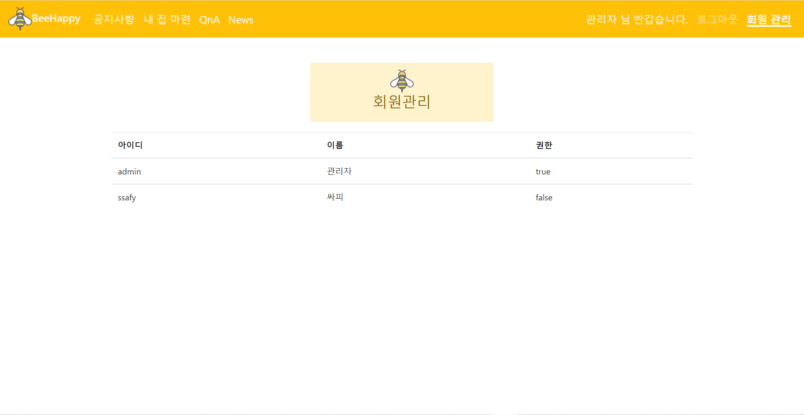
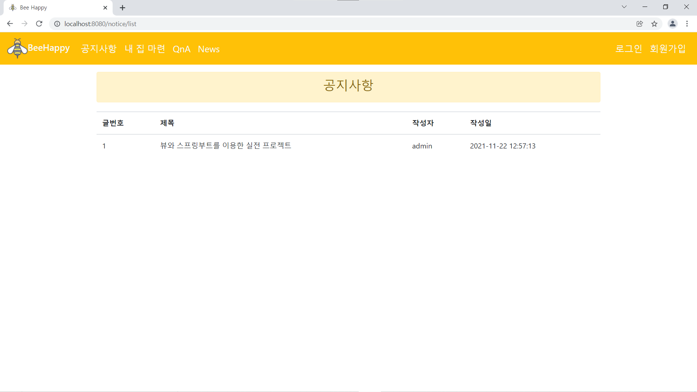
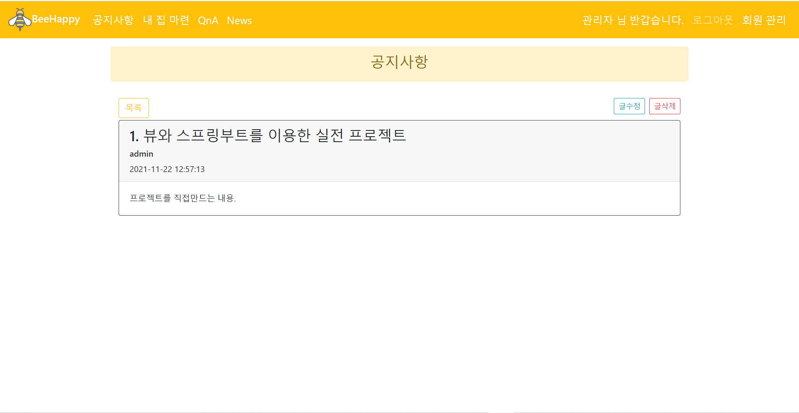
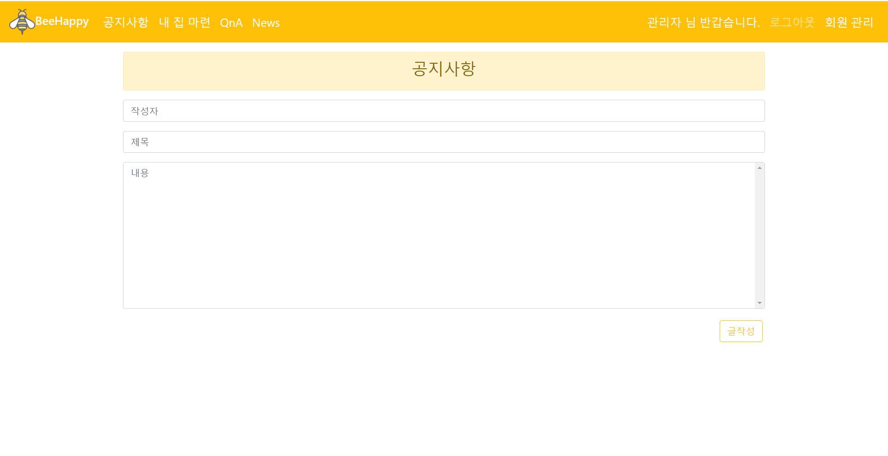
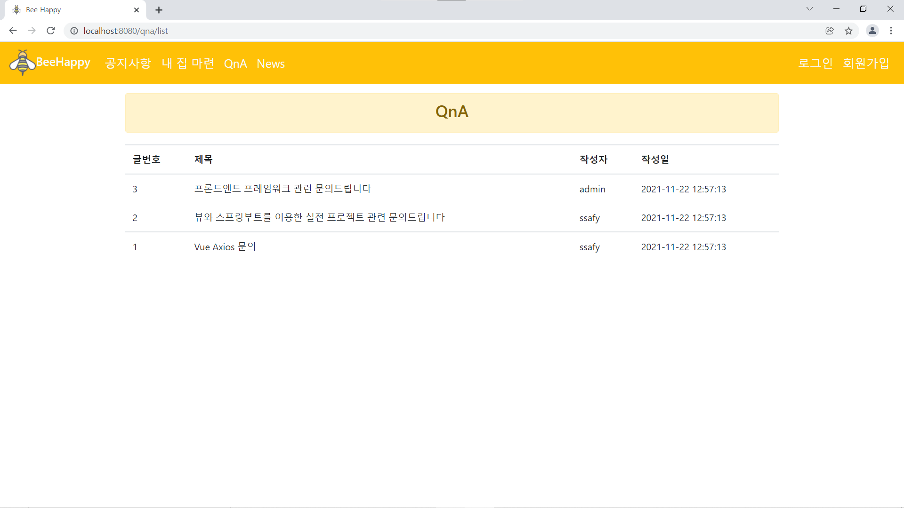
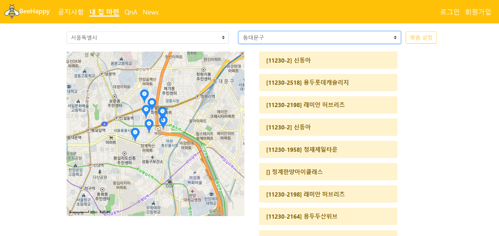
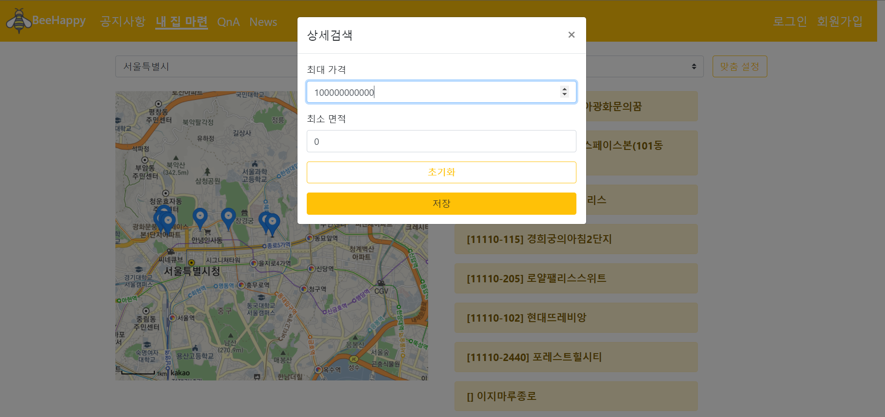

# BeeHappy

## 💡 ‘공공데이터를 활용한 주택거래정보 검색 사이트’


메인 페이지 (Main page)


로그인/ 회원가입





관리자 모드로 회원 관리



공지사항  (Notice)







QnA 게시판




집 정보 찾아보기






cheerio를 이용한 naver 부동산 뉴스 크롤링


:

## 🛠️ 개발에 사용한 기술 스택을 알려드릴게요.

### 🖥️ Front-end

### 


### 🛢️ Back-end


### 🛠️ Tools


## 👉 실행방법

```bash
$ cd Frontend
```

1. node_modules 설치

```bash
$ npm install
```

1. 개발 서버 실행

```bash
$ npm run serve
```
